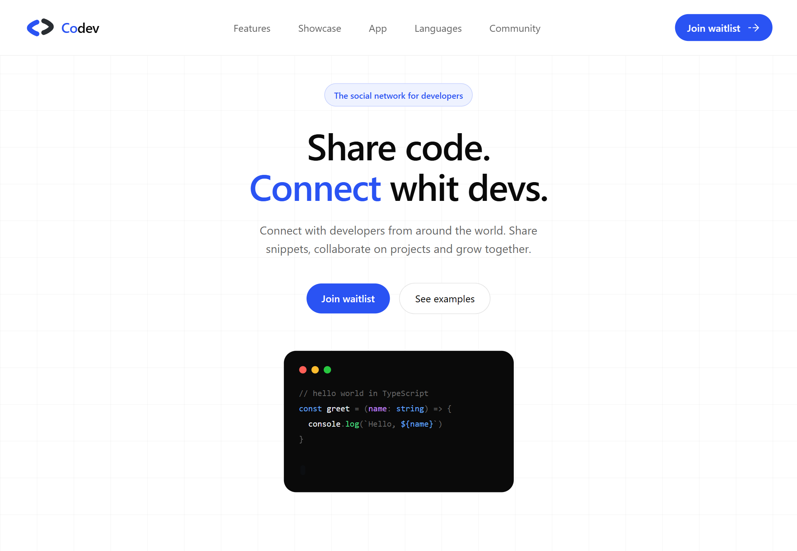

# Codev — Landing Page



> La red social para desarrolladores. Comparte código, conéctate y colabora con desarrolladores de todo el mundo.


 
 
 


---

## 📖 About

**Codev** Es un concepto para una red social diseñada exclusivamente para desarrolladores: un espacio para compartir fragmentos de código, descubrir nuevas técnicas, colaborar en proyectos y conectar con la comunidad global de desarrolladores.

Este repositorio contiene la **Landing Page** diseñada para comunicar la visión del producto, con maquetas reales de la aplicación móvil, secciones animadas y un botón de llamada a la acción para la lista de espera.

---

## ✨ Features

- **Hero** with typing animation and grid background
- **Features section** with real mobile mockups (Connect, Collaborate, Dev Live)
- **Code Showcase** with syntax-highlighted snippet posts
- **App Preview** with perspective phone layout
- **Languages section** with real SVG icons via `svgl-react`
- **Waitlist CTA** with email input and success state
- **Scroll animations** powered by Framer Motion
- **Minimal navbar** with mobile hamburger menu
- **Fully responsive** design

---

## 🛠️ Tech Stack

| Tool | Purpose |
|------|---------|
| [Bun](https://bun.com/) | Runtime & package manager |
| [Vite](https://vite.dev/) | Bundler & dev server |
| [React 19](https://react.dev/) | UI library |
| [TypeScript](https://www.typescriptlang.org) | Type safety |
| [Tailwind CSS v4](https://tailwindcss.com) | Styling |
| [Framer Motion](https://www.framer.com/motion) | Animations |
| [@ridemountainpig/svgl-react](https://github.com/ridemountainpig/svgl-react) | Language SVG icons |
| [@boxicons/react](https://boxicons.com) | Social & UI icons |

---

## 🚀 Getting Started

### Prerequisites

Make sure you have [Bun](https://bun.sh) installed:

```bash
curl -fsSL https://bun.sh/install | bash
```

### Installation

```bash
# Clone the repo
git clone https://github.com/luisart3/codev.git

# Navigate to the project
cd codev

# Install dependencies
bun install

# Start the dev server
bun run dev
```

Open [http://localhost:5173](http://localhost:5173) in your browser.

### Build for production

```bash
bun run build
```

### Deploy to GitHub Pages

```bash
bun run deploy
```

---

## 📁 Project Structure

```
src/
├── assets/
│   ├── people/        # Developer avatars
│   ├── mobile/         # App screenshots (home, profile, onboarding)
│   └── Codev.svg       # Logo
├── components/
│   ├── icons/          # Custom SVG icon components
│   |__ ui/              # UI components
│      |__ Navbar.tsx     # Navigation bar
│      |__ Hero.tsx       # Hero with typing animation
│   
├── data/
│   ├── snippets.ts     # Code post mock data
│   └── features.ts     # Avatar imports
└── sections/
    ├── Features.tsx     # Connect, Collaborate, Dev Live
    ├── AppPreview.tsx   # Mobile screens in perspective
    ├── Showcase.tsx     # Code snippet posts
    ├── Languages.tsx    # Supported languages
    ├── CTA.tsx          # Waitlist section
    └── Footer.tsx       # Footer with social links
```

---

## 📱 App Design

El diseño movil se hizo antes que la landing page, 
incluyendo:
- **Onboarding flow** — 3 screens introducing Connect, Collaborate and Dev Live
- **Home feed** — code posts with syntax highlighting, likes, comments and shares
- **Developer profile** — with followers, technologies, posts and Dev Live tab

---

## 🎨 Design Decisions

- **Light mode** with `#f9f9f9` and `#ffffff` backgrounds for a clean, minimal feel
- **Brand blue** `#2A53F3` as the primary accent color
- **Minimal navbar** — logo + hamburger + CTA button, no traditional link overload
- **Framer Motion** scroll animations with `useInView` for performance
- **Real mobile mockups** integrated into feature cards for authentic product feel

---

## 🔗 Links

- 🌐 **Live demo:** [Codev](https://luisart3.github.io/codev/)
- 🎨 **Portfolio:** [Luis Arteaga](https://luisart3.github.io/luisdev/)

---

## 👤 Author

**Luis Arteaga**
- GitHub: [Luis Arteaga](https://github.com/luisart3)
- LinkedIn: [Luis Arteaga](https://www.linkedin.com/in/luisart-dev/)

---

<p align="center">
  Designed with ❤️ for developers.
</p>